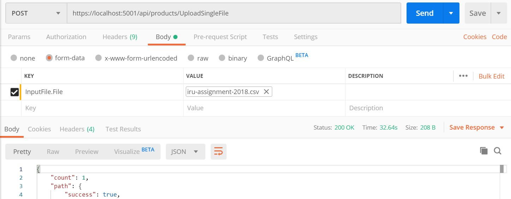
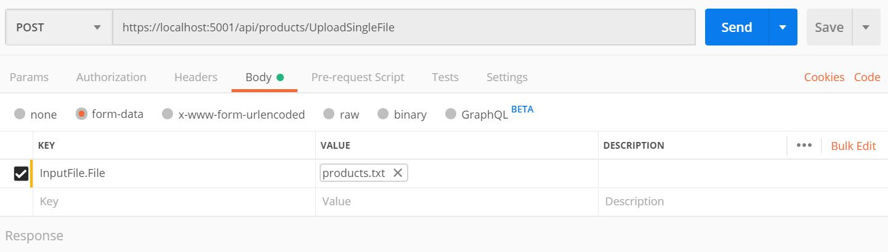

# ireckonu-products-uploader

IRECKONU mini web app to upload product items in batches to storage.

##### basic requirements:
Backend - C# .NET Core web API
1.          Import the file via web API, expect the file to be very large in production
2.          Transform the data into a logical model
3.          Store the data (two locations - a Database and JSON file)
o   Database (can be either MS SQL or MongoDB - you choose)
o   JSON file on the disk
Data: Sample File: https://goo.gl/tJWo1f

##### Key Design Points:
1. using CQRS pattern to differentiate between storing and retrieving data models.  (probably not essential pattern now given the current app scope, however in case app will display imported products so better to follow this pattern to avoid reading data being impacted with files processing)
2. Clean architecture is followed to have domain layer in the heart of the implementation for business isolation decoupled from UI or repository changes.
3. dynamic saving and extracting content based on input file using interfaces
4. swagger UI support for Apis specifications.
5. asynchronous patter for I/O operations, in order to consider large file processing, accordingly avoding processing files in memory to avoid being the consumer thread if blocked, and instead saving the file on physical storage then process it local file content asynchronously.
6. auto mapper library is used to automatically map between models of different layers following separation of concerns.
7. Dependency injection container is used to use interfaces for dependencies control and single responsibility of object instantiating and management during request life cycle.
8. Mocing framework is used for unit testing.

##### How to use:
1. Clone 'development' repository then open solution in VS 2019
2. Open appsettings and change the default path of folders to yours. "StoredFilesPath": "c:\\files"
3. Launch the application to open swagger UI page showing our Api.
4. Use Postman or any API invoker like Fiddler to invoke our Api

